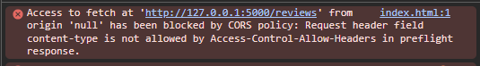

# Diário de Desenvolvimento

## Erros de aplicação.

### Erro de Firewall
Devido ao firewall da faculdade, a API da twitch que utilizamos para buscar os jogos acabava sendo bloqueada. A solução rápida e prática foi de alterar a rede.

### Erro de CORS
Ao integrar o front com o back, durante as leituras ocorriam erros de CORS (vide imagem abaixo), e para solucionar, foram colocados os seguintes trechos de código na api para permitir as requisições sem maiores verificações de segurança.

```python
# ajusta problema de CORS que acontecia ao se comunicar com o front
@app.after_request
def add_cors_headers(response):
    response.headers["Access-Control-Allow-Origin"] = "*"
    response.headers["Access-Control-Allow-Headers"] = "Content-Type"
    response.headers["Access-Control-Allow-Methods"] = "GET, POST, DELETE, OPTIONS"
    return response

# manda as infos do CORS para dizer que pode mandar a requisição real, pois o CORS deu o ok
@app.route("/reviews", methods=["OPTIONS"])
@app.route("/reviews/<int:game_id>", methods=["OPTIONS"])
def reviews_preflight(game_id=None):
    return "", 204
```


## Erros de Infra